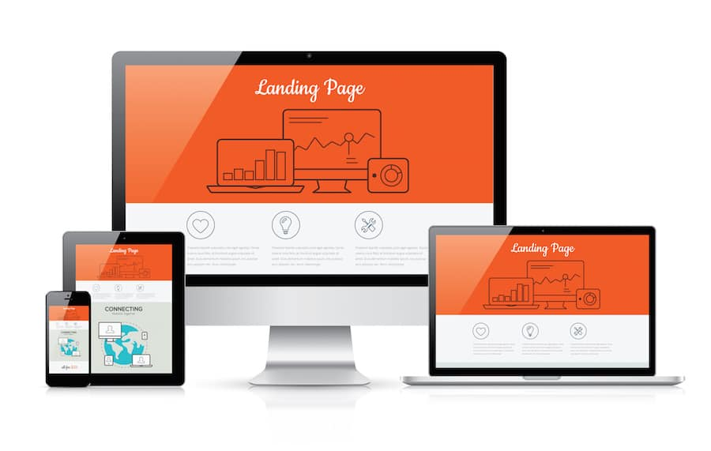

<h1 align="center">Desafio de projeto: Landing Page com HTML e CSS </h1>

    <b>PROJETO</b>: construir a primeira Landing Page com HTML e CSS, colocando em prática os fundamentos do CSS, as propriedades básicas da linguagem de estilização, além de trabalhar com as unidades de medidas relativas e absolutas que aprendemos ao longo da trilha. 

<h1 align="center">
   Landing Page
</h1>

 

  <a href="#-tecnologias">Tecnologia</a>&nbsp;&nbsp;&nbsp;|&nbsp;&nbsp;&nbsp;
  <a href="#-projeto">Projeto</a>&nbsp;&nbsp;&nbsp;|&nbsp;&nbsp;&nbsp;

  

## 🚀 Tecnologias

Esse projeto foi desenvolvido com as seguintes tecnologias:

- HTML
- CSS
- Git e Github

## 💻 Projeto

Desafio de Projeto DIO: construir a primeira Landing Page com HTML e CSS, colocando em prática os fundamentos do CSS.

---

Feito com ♥ by Antonio Pereira